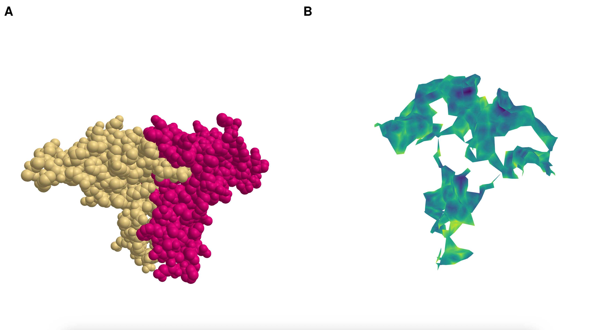

TopologicalInterfaces.jl constructs a surface between differently *colored* subsets of points. The following image illustrates the construction for possible variations of colorings of a tetrahedron:

The interface surface is triangulated by construction. The vertices are placed at the midpoints between the barycenters of multicolored vertices/edges/triangles. The colors on the interface surface illustrate an assigned value based on the distance between the barycenters. The values are extended to the edges and triangles as an upper star filtration.

Potential applications are the construction of protein-protein interfaces like shown below for a dimer of a [Heptatitis B core protein](https://www.rcsb.org/structure/4BMG)

